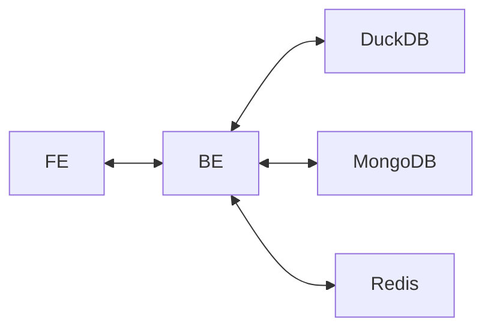

# Concessionária - Projeto de Banco de Dados

## Sobre o projeto

Este projeto implementa um sistema de **catálogo e pedidos de carros** com base no conceito de **persistência poliglota (Polyglot Persistence)**. A proposta é utilizar diferentes bancos de dados de acordo com o tipo de informação e a necessidade da aplicação.

O sistema permite:

- cadastro de usuários;
- login;
- alteração de senha;
- visualização do catálogo de carros;
- adição de carros ao catálogo;
- remoção de carros do catálogo;
- realização de pedidos;
- listagem de pedidos;
- cancelamento de pedidos;
- atualização do status dos pedidos.

## Arquitetura

O projeto segue a estrutura solicitada no enunciado, com **frontend**, **backend**, **um banco relacional** e **dois bancos não relacionais**.



### Componentes

- **FE (Frontend):** páginas HTML servidas pelo backend para interação com o usuário.
- **BE (Backend):** aplicação em Python com FastAPI, responsável por receber as requisições e acessar os bancos de dados.
- **DuckDB:** banco relacional utilizado para armazenar os dados dos usuários.
- **MongoDB:** banco orientado a documentos utilizado para armazenar o catálogo de carros.
- **Redis:** banco chave-valor utilizado para armazenar os pedidos.

## Justificativa dos bancos utilizados

### DuckDB (Relacional)

O DuckDB foi utilizado para armazenar os dados de usuários, como nome e senha. Esse tipo de dado possui estrutura fixa e se encaixa bem no modelo relacional.

**Motivos da escolha:**

- dados estruturados;
- uso de consultas SQL;
- facilidade para validação de login.

### MongoDB (Document Storage)

O MongoDB foi usado para armazenar o catálogo de carros. Como os carros são tratados como documentos, esse modelo facilita inserção, leitura e remoção de dados sem depender de um esquema rígido.

**Motivos da escolha:**

- flexibilidade no armazenamento dos carros;
- manipulação direta com objetos/dicionários;
- simplicidade nas operações de catálogo.

### Redis (Chave-valor)

O Redis foi utilizado para armazenar os pedidos. Cada pedido é salvo com uma chave própria, contendo informações como carro, quantidade, cidade e status.

**Motivos da escolha:**

- acesso rápido por identificador;
- estrutura simples para pedidos;
- facilidade de atualização de status.

## Backend e rotas principais

O backend foi desenvolvido em **Python** com **FastAPI** e centraliza a comunicação entre o frontend e os três bancos de dados.

### Rotas de usuários

- `POST /login`
- `POST /cadastro`
- `POST /mudarsenha`

### Rotas de catálogo

- `GET /catalogo`
- `GET /dados`
- `POST /adicionar`
- `POST /deletar`

### Rotas de pedidos

- `GET /pedido`
- `GET /pedidos`
- `POST /fazer_pedido`
- `POST /cancelar_pedido`
- `POST /atualizar_pedido`

## Tecnologias utilizadas

- **Python**
- **FastAPI**
- **Uvicorn**
- **DuckDB**
- **MongoDB**
- **Redis**
- **Pydantic**

## Como executar o projeto

### Pré-requisitos

Antes de executar, é necessário ter instalado:

- Python 3.10 ou superior; (link: https://www.python.org/downloads/)
- `pip`; (link: https://pypi.org/project/pip/)
- acesso à internet para conexão com MongoDB e Redis;
- os arquivos de frontend na mesma pasta do `main.py`.

### Instalação das dependências

```bash
pip install fastapi uvicorn duckdb pymongo redis pydantic
```
### Configuração

O backend utiliza:

- um arquivo DuckDB local;
- uma conexão com MongoDB Atlas;
- uma instância Redis remota.

**Importante:**

- o caminho do DuckDB está fixado no código e pode precisar ser alterado na sua máquina;
- as credenciais do MongoDB e do Redis estão definidas diretamente no arquivo `main.py`.

### Execução

Para iniciar o servidor, execute:

```bash
python main.py
```

A aplicação será executada localmente em:

```bash
http://127.0.0.1:8000
```

## Estrutura esperada no repositório

Para atender aos requisitos do trabalho, o repositório deve conter:

- todo o código-fonte desenvolvido;
- o arquivo `README.md`;
- os arquivos de frontend;
- todos os recursos necessários para rodar o projeto em um ambiente novo.

